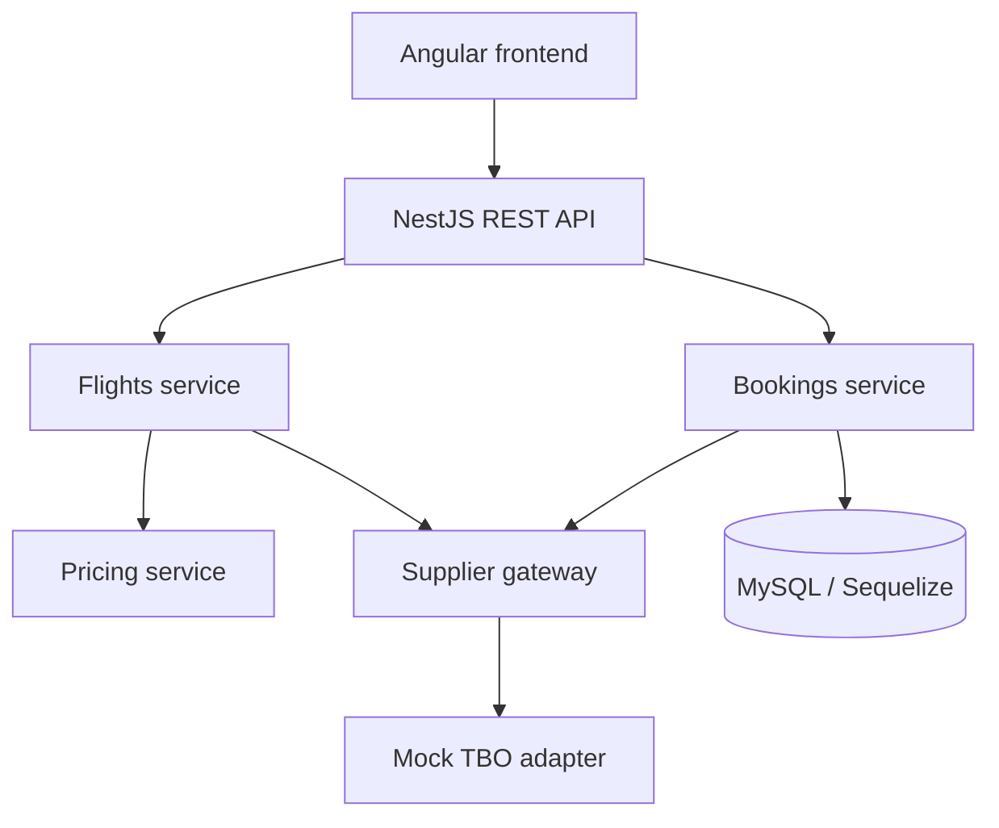

# Tixxgo — Flight Booking Platform

Tixxgo is a supplier-independent flight-booking platform built as a full-stack assessment project. It demonstrates flight search, supplier response normalization, pricing, fare revalidation, traveller details, booking, payment recording, supplier confirmation, reconciliation, cancellation, and refund-pending workflows.

The application uses a mocked TBO integration. Supplier result keys and supplier-specific response fields stay on the backend; Angular receives only Tixxgo's normalized models.

## Features

- Flight search with validated criteria and normalized offers.
- Mock TBO adapter with supplier-independent models.
- Configurable price calculation and fare revalidation.
- Explicit price-change acceptance before booking.
- Traveller and contact information collection.
- Idempotent booking creation using a client-generated key.
- Mock payment, supplier booking, PNR, and ticket-number records.
- `SUPPLIER_UNKNOWN` handling and supplier-status reconciliation API.
- Booking details, cancellation preview, cancellation, and `REFUND_PENDING` state.
- Responsive, lazy-loaded Angular pages and Swagger API documentation.

## Tech stack

| Layer | Technology |
| --- | --- |
| Frontend | Angular 18, TypeScript, Reactive Forms, RxJS |
| Backend | NestJS 10, TypeScript, REST / JSON |
| Database | MySQL 8 |
| ORM and migrations | Sequelize, sequelize-typescript, Sequelize CLI |
| Supplier | Mock TBO adapter |
| API documentation | Swagger / OpenAPI |
| Local database | Docker Compose |
| Testing | Jest; Karma/Jasmine configuration |

## Architecture



- **Angular** provides search, results, traveller, confirmation, and booking-details pages. API calls are isolated in typed services.
- **Controllers** validate DTOs and expose REST endpoints.
- **FlightsService** creates opaque offer IDs, applies pricing, and keeps supplier result keys in an in-memory server-side cache.
- **PricingService** owns the Tixxgo fee and discount rules.
- **SupplierGateway** is the only entry point to suppliers; it selects an adapter by supplier name.
- **TboAdapter** maps TBO-shaped data to shared internal models.
- **BookingsService** owns the booking state machine, idempotency, payment record, supplier booking, cancellation, and reconciliation logic.
- **Sequelize entities/migrations** persist bookings, travellers, payments, and supplier-booking data.

## Project structure

```text
frontend/                         Angular application
  src/app/core/                   API/state services and models
  src/app/features/flights/       Search and results pages
  src/app/features/booking/       Traveller, confirmation, details pages
backend/                          NestJS API
  src/flights/                    Search, pricing, revalidation
  src/bookings/                   Lifecycle, DTOs, Sequelize entities
  src/supplier/                   Gateway, adapter interface, TBO mock adapter
  database/migrations/            Sequelize migrations
docker-compose.yml                MySQL service
.env.example                      Local configuration template
```

## Prerequisites

- Node.js and npm
- Docker Desktop (recommended), or a reachable MySQL 8 instance

## Run locally

1. Create the local environment file:

   ```powershell
   Copy-Item .env.example .env
   ```

2. Start MySQL:

   ```powershell
   docker compose up -d mysql
   ```

3. Install backend dependencies and apply the migrations:

   ```powershell
   cd backend
   npm install
   npx sequelize-cli db:migrate --config database/config.js
   ```

4. Start the API:

   ```powershell
   npm run start:dev
   ```

   The API is at `http://localhost:3000`; Swagger is at `http://localhost:3000/api/docs`.

5. In a second terminal, start Angular:

   ```powershell
   cd frontend
   npm install
   npm start
   ```

   Open `http://localhost:4200`.

The development frontend targets `http://localhost:3000` in `frontend/src/environments/environment.ts`. Backend CORS allows the Angular development server at port 4200.

## Configuration

| Variable | Purpose |
| --- | --- |
| `PORT` | NestJS port; default `3000` |
| `DB_HOST`, `DB_PORT`, `DB_NAME`, `DB_USER`, `DB_PASSWORD` | MySQL connection |
| `DB_ROOT_PASSWORD` | MySQL Docker root password |
| `TIXXGO_SERVICE_FEE` | Fee added to a supplier fare |
| `TIXXGO_DEFAULT_DISCOUNT` | Discount subtracted from the price |
| `SUPPLIER_TIMEOUT_MS` | Supplier timeout configuration value |

## Booking flow

1. A customer searches for flights.
2. The backend retrieves supplier results through the gateway, transforms them into normalized offers, applies Tixxgo pricing, and returns client-safe fields.
3. The customer selects an offer and enters traveller/contact details.
4. The offer is revalidated before booking.
5. If the price changed, the booking request must set `acceptedPriceChange: true`; unavailable offers require a new search.
6. A Sequelize transaction creates the booking and traveller records. The mock payment record is then created.
7. The backend submits the supplier booking and stores the supplier result on confirmation.

### Pricing

```text
final price = supplier base fare + supplier taxes + Tixxgo service fee − Tixxgo discount
```

The pricing snapshot is stored on a booking, so later configuration changes do not alter its historical price.

### Revalidation

`POST /api/flights/revalidate` returns one of:

- `PRICE_CONFIRMED` — the offer can proceed to booking.
- `PRICE_CHANGED` — the cached offer is updated and explicit acceptance is required.
- `FLIGHT_UNAVAILABLE` — the offer cannot be booked.

The backend enforces both revalidation and price acceptance.

### Payment, supplier booking, and timeouts

Payment and booking statuses are separate: the current implementation records a **mock** payment before calling the supplier. This represents the real-world case where payment succeeds but supplier booking later fails or is uncertain.

If a timeout-like supplier error occurs, the booking is marked `SUPPLIER_UNKNOWN`, not failed. Repeating the request with the same idempotency key returns the existing booking, preventing a duplicate booking. The check-status API reconciles an unknown booking: a confirmed supplier result becomes `CONFIRMED`; a failed one becomes `FAILED` and `REFUND_PENDING`.

### Cancellation and refunds

Only confirmed bookings can be cancelled. Cancellation preview returns mock supplier charges and an estimated refund. Cancellation stores the supplier cancellation details, marks the booking `CANCELLED`, and sets payment to `REFUND_PENDING`. No external refund gateway is invoked.

## API reference

Responses use the application `ApiResponse` envelope. DTO validation is applied with NestJS validation pipes. Run the API and visit Swagger at `/api/docs` for schemas and examples.

| Method | Endpoint | Purpose |
| --- | --- | --- |
| `POST` | `/api/flights/search` | Search normalized, priced offers |
| `POST` | `/api/flights/revalidate` | Revalidate an offer's fare and availability |
| `POST` | `/api/bookings` | Create an idempotent booking after revalidation |
| `GET` | `/api/bookings/:ref` | Retrieve a booking by customer reference |
| `GET` | `/api/bookings/:id/cancel-preview` | Get cancellation/refund estimate by internal UUID |
| `POST` | `/api/bookings/:id/cancel` | Cancel a confirmed booking |
| `POST` | `/api/bookings/:id/check-status` | Reconcile a `SUPPLIER_UNKNOWN` booking |

## Adding another supplier

1. Create an adapter implementing `SupplierAdapter`.
2. Map that supplier's search, revalidation, booking, status, and cancellation responses to the shared supplier models.
3. Register the adapter in `SupplierGateway`.

Flight and booking services remain unchanged because they use the gateway and normalized models rather than a supplier-specific format.

## Testing and scripts

From `backend/`:

```powershell
npm run build
npm test
npm run test:e2e
npm run test:cov
```

From `frontend/`:

```powershell
npm run build
npm test
```

Tests are configured in this repository. This README does not claim that tests or a deployment have been run.

## Current limitations

- TBO is mock/static data; no live supplier API is called.
- Offers use an in-memory cache, are lost on restart, and have no enforced TTL.
- Payment processing and refunds are mocked; there is no payment provider.
- Timeout handling is implemented, but the mock adapter does not make network calls or deliberately simulate timeouts.
- Supplier-status reconciliation is a backend endpoint; the Angular booking API service does not expose a check-status action.
- There is no authentication, authorization, account system, or “My Bookings” list.
- The offer UI is simplified to a single-leg view.
- Docker Compose starts MySQL only; frontend and backend run through their npm scripts.

## Production-minded next steps

- Replace the TBO mock with authenticated live API calls, safe retry/timeout handling, and error mapping.
- Persist offers in Redis or a database with real TTLs.
- Integrate a payment gateway, refund workflow, webhooks, and background reconciliation.
- Add authentication, authorization, audit trails, rate limiting, and secret management.
- Add broader automated tests, CI, structured logs, monitoring, and health checks.
